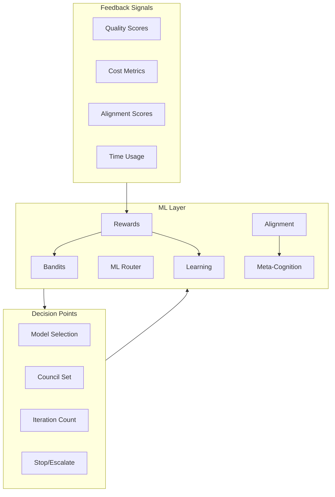
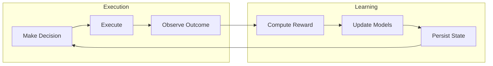
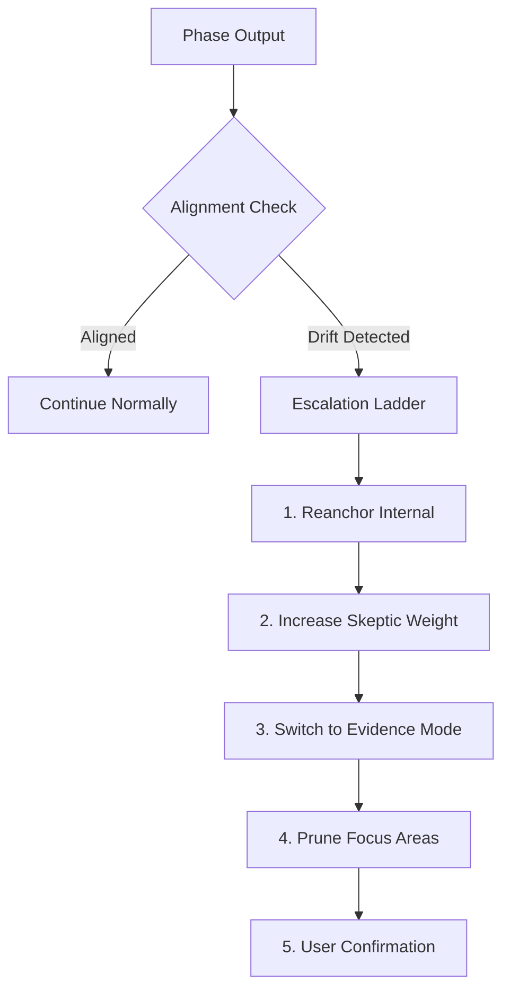
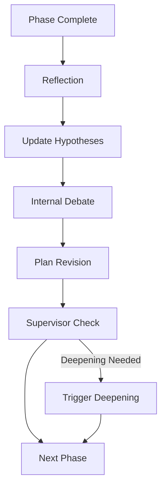

# DeepThinker Architecture Guide

This document provides a visual guide to the DeepThinker multi-agent AI system architecture.

## Table of Contents

- [System Overview](#system-overview)
- [Mission Lifecycle](#mission-lifecycle)
- [Council Architecture](#council-architecture)
- [Phase Execution](#phase-execution)
- [Consensus Mechanisms](#consensus-mechanisms)
- [Memory Systems](#memory-systems)
- [ML Layer](#ml-layer)
- [Key Concepts](#key-concepts)

---

## System Overview

DeepThinker is a **time-bounded, multi-agent autonomous AI system** that orchestrates specialized councils to accomplish complex objectives.

---

## Mission Lifecycle

A mission progresses through distinct phases, each with allocated time budgets.

### Phase Time Allocation

Time budgets are automatically distributed across phases based on mission complexity:

---

## Council Architecture

Each council is a specialized team of AI agents working toward a common goal.

### Council Responsibilities

### Multi-View Reasoning

For balanced analysis, DeepThinker employs optimist and skeptic councils:

---

## Phase Execution

Each phase contains discrete steps executed by the Step Engine.

### Iterative Refinement Loop

Councils can iterate to improve quality:

---

## Consensus Mechanisms

Multiple agents reach consensus through structured mechanisms.

### Critique Exchange

### Voting Mechanism

---

## Memory Systems

DeepThinker uses multiple memory systems for context retention.

### RAG Flow

---

## ML Layer

DeepThinker includes a **machine learning layer** for continuous improvement and intelligent decision-making.

### Components

| Component | Purpose | Key Feature |
|-----------|---------|-------------|
| **Bandits** | Exploration-exploitation for model/council selection | UCB & Thompson Sampling |
| **ML Router** | Supervised routing advisor | Council, model tier, rounds |
| **Rewards** | Unified reward computation | Versioned, deterministic, auditable |
| **Learning** | Online learning for stop/escalate | Incremental updates |
| **Alignment** | Soft correction for objective drift | Escalation ladder |
| **Meta-Cognition** | Self-reflection and hypothesis management | Depth contracts |

### Learning Loop

### Alignment Control

Soft corrective pressure when missions drift from objectives:

### Meta-Cognition Engine

After each phase, the meta-cognition engine:

---

## Key Concepts

### Effort Levels

Missions are categorized by time investment:

| Level | Duration | Use Case |
|-------|----------|----------|
| Quick | 5-15 min | Simple research, quick analysis |
| Standard | 15-60 min | Moderate complexity tasks |
| Deep | 1-4 hours | In-depth analysis, complex coding |
| Marathon | 4+ hours | Comprehensive projects |

### Phase Types

| Phase | Purpose | Primary Council |
|-------|---------|-----------------|
| Reconnaissance | Gather context and resources | Researcher |
| Analysis & Planning | Strategic planning | Planner |
| Deep Analysis | In-depth investigation | Evaluator + Evidence |
| Synthesis | Consolidate findings | Planner |

### Arbiter Role

The Arbiter is the final decision-maker that:

---

## Data Flow Example

Complete flow for a research mission:

---

## Technology Stack

---

## Further Reading

- [README.md](README.md) - Quick start and CLI reference
- [deepthinker/missions/](deepthinker/missions/) - Mission orchestration code
- [deepthinker/councils/](deepthinker/councils/) - Council implementations
- [deepthinker/consensus/](deepthinker/consensus/) - Consensus mechanisms

### ML Layer Modules
- [deepthinker/bandits/](deepthinker/bandits/) - Multi-armed bandits
- [deepthinker/routing/](deepthinker/routing/) - ML-based routing
- [deepthinker/rewards/](deepthinker/rewards/) - Reward signals
- [deepthinker/learning/](deepthinker/learning/) - Online learning
- [deepthinker/alignment/](deepthinker/alignment/) - Alignment control
- [deepthinker/meta/](deepthinker/meta/) - Meta-cognition engine

