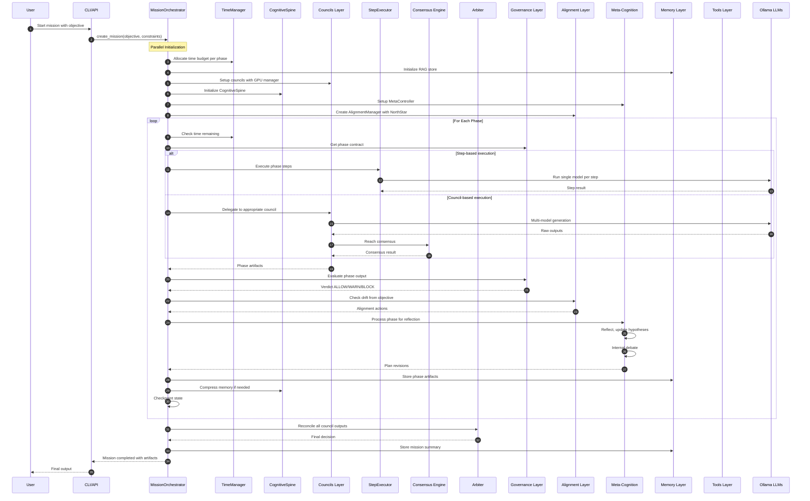
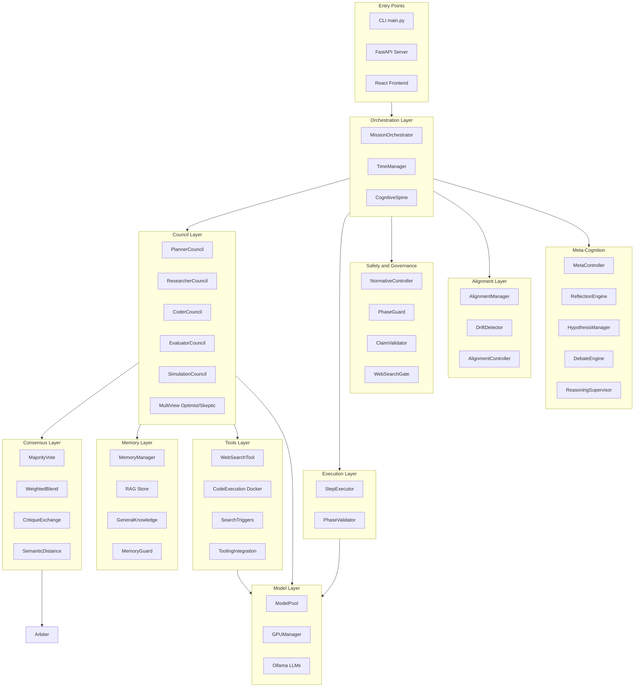

# DeepThinker

A long-running, time-bounded multi-agent autonomous AI system for complex reasoning and analysis tasks.

DeepThinker orchestrates multiple specialized AI councils to accomplish complex objectives through structured phases, iterative refinement, and metric-based evaluation—all running locally via Ollama.

## Architecture

```
                    ┌─────────────────────────────────────────┐
                    │           Mission Orchestrator          │
                    │    (Time-bounded, multi-phase execution)│
                    └────────────────────┬────────────────────┘
                                         │
        ┌────────────────────────────────┼────────────────────────────────┐
        │                                │                                │
        ▼                                ▼                                ▼
┌───────────────┐              ┌───────────────┐              ┌───────────────┐
│    Planner    │              │  Researcher   │              │    Coder      │
│    Council    │              │    Council    │              │    Council    │
│               │              │               │              │               │
│ - Strategy    │              │ - Web search  │              │ - Code gen    │
│ - Workflow    │              │ - RAG memory  │              │ - Revision    │
│ - Synthesis   │              │ - Sources     │              │ - Consensus   │
└───────────────┘              └───────────────┘              └───────────────┘
        │                                │                                │
        └────────────────────────────────┼────────────────────────────────┘
                                         │
        ┌────────────────────────────────┼────────────────────────────────┐
        │                                │                                │
        ▼                                ▼                                ▼
┌───────────────┐              ┌───────────────┐              ┌───────────────┐
│   Evaluator   │              │  Simulation   │              │    Arbiter    │
│    Council    │              │    Council    │              │               │
│               │              │               │              │ Final decision│
│ - Quality     │              │ - Testing     │              │ reconciliation│
│ - Feedback    │              │ - Scenarios   │              │               │
│ - Scoring     │              │ - Validation  │              │               │
└───────────────┘              └───────────────┘              └───────────────┘
```

### Mission Phases

Missions execute through structured phases, each with time budgets:

1. **Reconnaissance** - Gather context, background information, and relevant resources
2. **Analysis & Planning** - Strategic planning and workflow design
3. **Deep Analysis** - In-depth investigation using evidence and evaluation councils
4. **Synthesis & Report** - Consolidate findings into actionable outputs

### Mission Execution Flow

When a mission is launched, the system activates multiple layers working in concert. Here's the complete execution flow:



### System Component Layers

The following diagram shows all system layers and their relationships:



### Components Active Per Phase

| Phase | Primary Council | Key Tools | Safety Checks | Meta-Cognition |
|-------|-----------------|-----------|---------------|----------------|
| **Reconnaissance** | ResearcherCouncil | WebSearchTool, RAG Store | WebSearchGate, ClaimValidator | Reflection, Hypothesis Init |
| **Analysis & Planning** | PlannerCouncil | GeneralKnowledge | PhaseGuard | Debate, Plan Revision |
| **Deep Analysis** | EvaluatorCouncil, EvidenceCouncil | SearchTriggers, ToolingIntegration | NormativeController, ClaimValidator | Hypothesis Update, Deepening |
| **Synthesis** | PlannerCouncil | MemoryManager | PhaseValidator | Final Reflection |

**Always Active:** CognitiveSpine (schema validation), AlignmentManager (drift detection), TimeManager (budget tracking), Consensus Engine (multi-model agreement), Arbiter (final reconciliation)

## Features

### Core Capabilities
- **Multi-Council Architecture**: Specialized councils for planning, research, coding, evaluation, and simulation
- **Time-Bounded Missions**: Configurable time budgets with automatic phase allocation
- **Iterative Refinement**: Automatic quality improvement through multiple refinement cycles
- **Web Research Integration**: Automated research to gather documentation and best practices
- **Multi-View Reasoning**: Optimist/Skeptic councils for balanced analysis
- **Secure Code Execution**: Docker-based sandbox with security scanning
- **Local-First**: Runs entirely on your machine with Ollama—no external API calls
- **Checkpointing**: Mission state saved for resumability
- **Web UI & API**: React frontend with FastAPI backend for mission management

### Advanced Systems
- **ML Layer**: Multi-armed bandits for model selection, ML-based routing, online learning
- **Alignment Control**: Drift detection and soft corrective pressure via escalation ladder
- **Governance**: Normative layer with phase contracts and rule enforcement
- **Constitution Engine**: Configurable rules with blinding and ledger tracking
- **Epistemics**: Claim graphs, contradiction detection, and hypothesis tracking
- **Meta-Cognition**: Self-reflection, depth contracts, and hypothesis management
- **Proof-Carrying Reasoning**: Verifiable reasoning chains with attestation
- **Latent Memory**: HuggingFace transformers for semantic compression

## Quick Start

### Prerequisites

1. **Python 3.10+**
2. **Ollama** installed and running
   ```bash
   # Install Ollama: https://ollama.ai
   ollama serve
   ollama pull deepseek-r1:8b
   ```
3. **Docker** (optional, for code execution)
   ```bash
   # Build the sandbox image
   ./build_sandbox.sh
   ```

### Installation

```bash
cd deep_thinker

# Install with pip
pip install -e .

# Or with Poetry
poetry install
```

### Run a Mission

```bash
# Start a research/analysis mission (no code execution)
python3 main.py mission start \
  -o "Analyze how AI will transform global labor markets" \
  -t 15 \
  --no-code-exec \
  --verbose

# Start a coding mission
python3 main.py mission start \
  -o "Build a FastAPI REST API with authentication" \
  -t 30 \
  --allow-code-exec

# Check mission status
python3 main.py mission status --id <mission_id>

# List all missions
python3 main.py mission list
```

### Run the Web UI

```bash
# Start the API server
cd api && uvicorn server:app --reload --port 8000

# In another terminal, start the frontend
cd frontend && npm install && npm run dev
```

## Two Orchestration Stacks

DeepThinker has two distinct orchestration stacks optimized for different use cases:

### Run Workflow (`python3 main.py run`)

**Best for**: Single-pass code generation, ML model development with dataset evaluation

```bash
python3 main.py run "Create a binary search tree class" \
  --max-iterations 5 \
  --quality-threshold 8.0
```

Features:
- CrewAI-based agent execution
- Code generation with iterative improvement
- Dataset-based metric evaluation
- Simulation scenarios for testing

### Mission Engine (`python3 main.py mission`)

**Best for**: Long-running research, multi-phase analysis, complex objectives

```bash
python3 main.py mission start \
  --objective "Research quantum computing applications" \
  --time 60 \
  --verbose
```

Features:
- Time budget management with phase allocation
- Council architecture with consensus mechanisms
- State checkpointing and resumability
- API access via `/api/missions/`

## CLI Reference

### Mission Commands

```bash
# Start a new mission
python3 main.py mission start \
  --objective "Your objective here" \
  --time 60 \                        # Time budget in minutes
  --allow-internet \                 # Enable web research (default)
  --allow-code-exec \                # Enable code execution
  --verbose                          # Detailed output

# Other mission commands
python3 main.py mission status --id <id>    # Check status
python3 main.py mission list                 # List all missions
python3 main.py mission resume --id <id>    # Resume a mission
python3 main.py mission abort --id <id>     # Abort a mission
```

### Run Command (Code Generation)

```bash
python3 main.py run "Create a binary classifier" \
  --max-iterations 5 \
  --quality-threshold 8.0 \
  --data-path dataset.csv \         # Optional: dataset for evaluation
  --task-type classification \
  --enable-research \               # Enable web research
  --enable-planning                 # Enable planning phase
```

### Utility Commands

```bash
python3 main.py test-connection    # Test Ollama connection
python3 main.py list-models        # List available models
python3 main.py context councils   # Inspect council configurations
```

## Project Structure

```
deep_thinker/
├── deepthinker/              # Main package
│   ├── agents/               # Individual AI agents (Coder, Planner, etc.)
│   ├── councils/             # Council implementations
│   │   ├── planner_council/
│   │   ├── researcher_council/
│   │   ├── coder_council/
│   │   ├── evaluator_council/
│   │   ├── simulation_council/
│   │   ├── evidence_council/
│   │   ├── explorer_council/
│   │   └── multi_view/       # Optimist/Skeptic councils
│   ├── missions/             # Mission orchestration
│   ├── arbiter/              # Final decision reconciliation
│   ├── consensus/            # Multi-agent consensus (voting, critique exchange)
│   ├── memory/               # RAG and long-term memory
│   ├── latent_memory/        # Transformer-based semantic compression
│   ├── execution/            # Workflow and code execution
│   ├── models/               # Ollama LLM integration
│   ├── alignment/            # Drift detection and correction
│   ├── bandits/              # Multi-armed bandits for model selection
│   ├── routing/              # ML-based council/model routing
│   ├── rewards/              # Reward signal computation
│   ├── learning/             # Online learning (stop/escalate)
│   ├── meta/                 # Meta-cognition engine
│   ├── epistemics/           # Claim graphs and hypothesis tracking
│   ├── governance/           # Normative layer and phase contracts
│   ├── constitution/         # Constitutional AI rules engine
│   ├── proofs/               # Proof-carrying reasoning
│   ├── trust/                # Trust management
│   ├── observability/        # System monitoring
│   ├── personas/             # Agent persona definitions
│   └── tooling/              # Agent tools (web search, code exec)
├── api/                      # FastAPI backend
│   └── routes/               # API endpoints
├── frontend/                 # React/Vite frontend
├── tests/                    # Test suite
├── kb/                       # Knowledge base (RAG, missions, models)
├── main.py                   # CLI entry point
└── requirements.txt          # Dependencies
```

## Configuration

### Environment Variables

Create a `.env` file:

```bash
# Ollama configuration
OLLAMA_API_BASE=http://localhost:11434

# Default models
OLLAMA_MODEL=deepseek-r1:8b
```

### Model Selection

Different models can be assigned to different agents:

```bash
python3 main.py run "..." \
  --model-all cogito:14b \            # Override all agents
  --planner-model cogito:14b \        # Or set individually
  --coder-model deepseek-r1:8b \
  --evaluator-model gemma3:27b \
  --websearch-model gemma3:12b \
  --simulator-model mistral:instruct \
  --executor-model llama3.2:3b
```

### Docker Sandbox Images

Build specialized sandbox images for code execution:

```bash
# Standard Python sandbox
docker build -f Dockerfile.sandbox -t deepthinker-sandbox .

# With browser automation
docker build -f Dockerfile.sandbox-browser -t deepthinker-sandbox-browser .

# With GPU support
docker build -f Dockerfile.sandbox-gpu -t deepthinker-sandbox-gpu .

# With Node.js
docker build -f Dockerfile.sandbox-node -t deepthinker-sandbox-node .

# Trusted sandbox (more permissions)
docker build -f Dockerfile.sandbox-trusted -t deepthinker-sandbox-trusted .
```

## API Endpoints

The FastAPI server provides REST endpoints for mission management:

| Endpoint | Method | Description |
|----------|--------|-------------|
| `/api/missions/` | GET | List all missions |
| `/api/missions/` | POST | Create a new mission |
| `/api/missions/{id}` | GET | Get mission details |
| `/api/missions/{id}/start` | POST | Start a mission |
| `/api/missions/{id}/abort` | POST | Abort a mission |
| `/api/workflows/` | POST | Run a code generation workflow |
| `/api/agents/` | GET | List available agents |
| `/api/gpu/status` | GET | Check GPU availability |

SSE streaming is available for real-time mission updates.

## Development

### Running Tests

```bash
pytest tests/ -v

# With coverage
pytest tests/ --cov=deepthinker --cov-report=html
```

### API Development

```bash
cd api
uvicorn server:app --reload --port 8000
```

### Frontend Development

```bash
cd frontend
npm install
npm run dev
```

## License

MIT License - See LICENSE file for details.

---

Built with Ollama and Python
